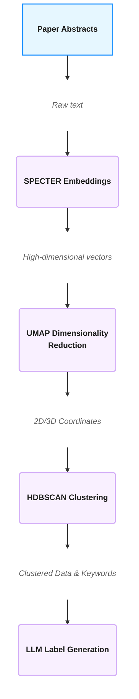

# Arbor-Scientiae
## A Tool to Advance Your Research

<i>authored by Leon Gasteiger</i>

 

### Table of Content

1. [Introduction](#introduction)
2. [Features](#features)

    

### Introduction

Whether you work in Science, Engineering or are just a curious person you probably have found yourself sometimes stuck reading tons of articles but not getting exactly what you want. 
I am currently writing my Master's Thesis and I realized how much time actually gets lost because finding the *right* paper at the *right* time is quite difficult. Don't get me wrong here, Research definitely is an important component when it comes to making your results align with current standards and breaking into a particular field. But from time to time it would be nice to speed up the process a little bit.

My project **Arbor Scientiae** tackles this problem by turning a pile of papers into an interactive knowledge graph using semantic search and ML-powered Clustering. It helps you getting an overview of the research landscape and find your desired knowledge faster.

    

### Features

**Keyword Matching**

For the beginning of the project keyword search is gonna be used. It is computationally cheaper compared to semantic search and provides quick results. Once this feature is fully implemented and works fine, semantic search will be added for more depth. (implemented)

 

**Semantic Search**

Besides keyword search in the initial stage, <i>Arbor Scientae</i> utilizes semantic search to fully grasp the context of research papers and provide meaningful visualizations. (in production)

 

**Interactive Knowledge Graph**

The results are presented in an interactive knowledge graph that can be traversed and explored by the user. Papers are represented as nodes and the links of the graph visualize the associations between those papers. This demonstration gives the user a quick and effective overview over the research landscape and helps to orientate in the desired field.

 

**ML-powered Clustering**

<i>Arbor Scientiae</i> leverages the power of ML to cluster the results and make sense of paper stacks. 

---
 ML-Workflow of Arbor Scientiae
---

---

### TechStack

**Data & APIs**

- [arXiv API](https://info.arxiv.org/help/api/user-manual.html) / [Semantic Scholar API](https://www.semanticscholar.org/product/api)

 

**ML & NLP**

- [SPECTER](https://huggingface.co/allenai/specter)
- [UMAP](https://umap-learn.readthedocs.io/en/latest/)
- [HDBSCAN](https://hdbscan.readthedocs.io/)
- [Anthropic API](https://docs.anthropic.com/)

 

**Graph & Visualization**

- [NetworkX](https://networkx.org/en/)
- [Pyvis](https://pyvis.readthedocs.io/en/latest/)

 

**Backend**

- [Python](https://www.python.org/)
- [FASTAPI](https://fastapi.tiangolo.com/)